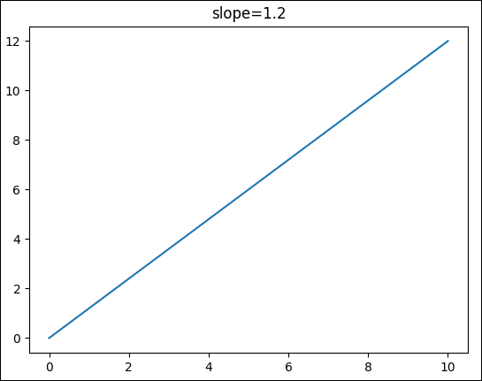
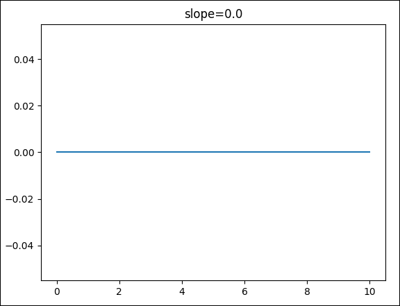
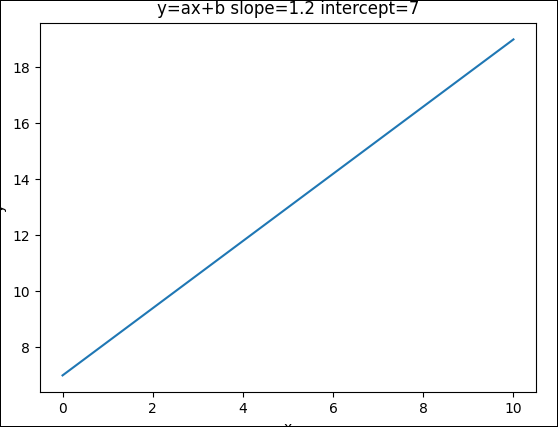

# <span style="color:red;">Machine Learning 2.0:</span> <span style="color:blue;">Grafico Lineare</span>
___
## Cenni teorici sulla funzione lineare
Un grafico **lineare** è un grafico rappresentante una linea retta frutto della funzione lineare: 

$$
\color{#DC006C}y=x
$$

Dunque, il grafico in questione avrà un aspetto del tipo:


Possiamo rappresentare una semplice funzione lineare in *python* con *matplotlib* con il seguente codice:

```python
import matplotlib.pyplot as plt

x = list()
y = list()

for i in range(11):
    x.append(i)
    y.append(i)

plt.plot(x,y)
plt.show()
```

L'output di questo codice sarà il medesimo dell'immagine di cui sopra, molto banalmente abbiamo inizializzato i valori $x$ ed $y$ con lo stesso valore con un ciclo *for* dopodichè abbiamo mandato in *plot* i valori dei due vettori.

## Pendenza della retta *(slope)*
Alla funzione di base di prima possiamo aggiungere una variabile $\bold{a}$, alterando il valore di questa variabile possiamo variare la pendenza della retta risultante, matematicamente possiamo descrivere tale funzione come: 

$$
\color{#DC006C}y=\bold{a}x
$$

Per implementare tale funzione in *python* ci basterà moltiplicare ogni valore di $y$ per il valore di *slope* da noi precedentemente definito:

```python
import matplotlib.pyplot as plt

slope = 1.2

x = list()
y = list()

for i in range(11):
    x.append(i)
    y.append(i * slope)

plt.plot(x,y)
plt.show()
```

L'output di questo codice produrrà il seguente grafico:



⚠: *Visivamente il grafico sembra essere lo stesso di prima, tuttavia, ci basta osservare l'asse $y$ per renderci conto che non è più uguale all'asse $x$.*

Di seguito, un esempio di come apparirebbe il grafico in questione senza pendenza, quindi, ponendo $\color{#DC006C}slope=0.0$



## Intercetta della Retta *(intercept)*
L'intercetta "$\bold{b}$" è l'ultima variabile da aggiungere per rendere la nostra funzione una ***funzione lineare***, molto semplicemente tale valore determina il punto di partenza della nostra retta sul grafico, pertanto, possiamo riscrivere definitvamente la nostra funzione lineare come:

$$
\color{#DC006C}y=ax+\bold{b}
$$

Possiamo implementare definitivamente la nostra funzione come codice *python*:

```python
import matplotlib.pyplot as plt

slope = 1.2
intercept = 7

x = list()
y = list()

for i in range(11):
    x.append(i)
    y.append(i * slope + intercept)

plt.plot(x,y)
plt.title("y=ax+b slope=1.2 intercept=7")
plt.xlabel("x")
plt.ylabel("y")
plt.show()
```

Il codice in questione produrrà il seguente output:



⚠: *Notare l'asse delle $y$ che partono da $7$, ovvero dal valore di ***intercetta*** da noi fissato.*

## Perchè devo conoscere la funzione lineare per imparare il Machine Learning?

Conoscere le funzioni lineare è fondamentale per intraprendere un percorso nel ramo del ML in quanto molte tecniche di apprendimento automatico si basano proprio sul concetto di funzione lineare come molti algoritmi di ***regressione lineare***, inoltre, una funzione lineare può risultare molto utile anche in fase di osservazione dei dati, in quanto, tracciare una buona retta lineare su un set di dati mostrati su un grafico a dispersione può rendere trasparente la struttura e la natura dei dati del nostro dataset.
Dunque, la funzione lineare è uno strumento di base fondamentale per intraprendere un percorso nel ML.